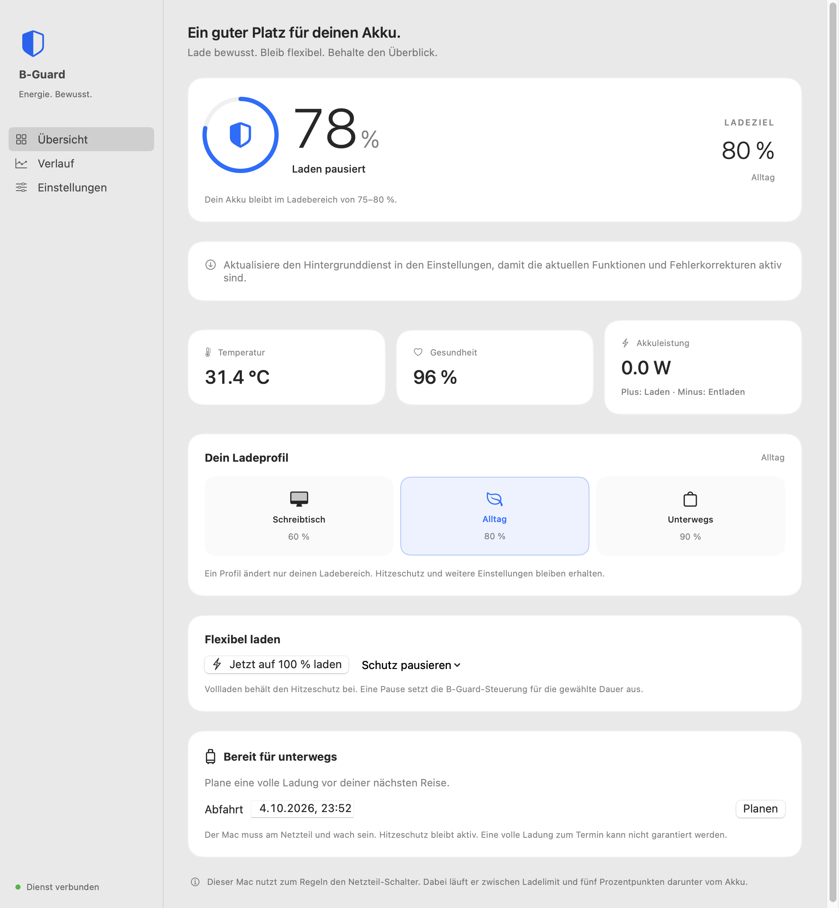

# B-Guard 0.2.2

Eine lokale macOS-App für bewusste Akkunutzung: Ladeprofile, geplante Ausnahmen und ein nachvollziehbarer Verlauf. Swift 6, macOS 14+, Apple Silicon.

[Website](https://darkspike1988.github.io/BatteryGuard/) · [DMG herunterladen](https://github.com/darkspike1988/BatteryGuard/releases/latest/download/B-Guard.dmg) · [GitHub](https://github.com/darkspike1988/BatteryGuard)

## Was B-Guard ergänzt

macOS bringt ein eigenes Ladelimit mit. B-Guard ergänzt Werkzeuge für den Alltag:

- **Ladeprofile:** Schreibtisch (55–60 %), Alltag (75–80 %) und Unterwegs (85–90 %). Eigene Grenzen bleiben in den Einstellungen verfügbar.
- **Reiseplanung:** Vollladen startet drei Stunden vor einem gewählten Termin. Nach 100 % oder spätestens eine Stunde nach dem Termin gilt wieder der vorherige Ladebereich. Der Mac muss wach und am Netzteil sein; eine vollständige Ladung zum Termin ist keine Garantie.
- **Zeitliche Schutzpause:** Eine, zwei oder zwölf Stunden mit automatischer Rückkehr zu den gespeicherten Einstellungen. Während der Pause greift B-Guard einschließlich Hitzeschutz nicht ein.
- **Einmaliges Vollladen:** Mit weiterhin aktivem konfiguriertem Hitzeschutz und einer maximalen Dauer von acht Stunden.
- **Lokaler Verlauf:** Ladung, Temperatur und Lade-/Entladeleistung. Ein Messpunkt pro Minute, bis zu sieben Tage. Aufzeichnung nur bei laufender App und aktuellen Messwerten; Schlaf- und Ausfallzeiten bleiben Lücken.
- **Auswertung:** Beobachtete Zeit, Zeit ab 90 % und Zeit ab 40 °C sowie höchste gemessene Temperatur. Keine erfundenen Verschleiß- oder Lebensdauerprognosen.
- **CSV-Export:** Alle lokal vorhandenen Messwerte zum eigenen Auswerten.
- **Native Limit-Erkennung:** Liest das auf dem lokalen Mac bestätigte CHLT-Layout. Unbekannte Layouts bleiben unberücksichtigt. Erkennt mögliche Konflikte mit höheren B-Guard-Zielen und verweist auf die Systemeinstellungen.
- **Mitteilungen:** Niedriger Akkustand, erreichtes Limit und hohe Temperatur sind getrennt einstellbar. Freigabe über den Button in den Einstellungen.

## Oberfläche

Das Menüleistenfenster bietet Status, Profile und schnelle Aktionen. Das Hauptfenster gliedert sich in Übersicht, Verlauf und Einstellungen. Systemtypografie, Systemfarben, Standard-Bedienelemente und Hell-/Dunkelmodus bilden die Grundlage.



Weitere Vorschauen: [Verlauf](docs/previews/light/history.png), [Menüleiste](docs/previews/light/menu.png), [Dunkelmodus](docs/previews/dark/overview.png).

## Drei Steuerungsmodi

**macOS – nur beobachten:** macOS steuert das Laden. Profile, Reiseplan und Schutzpausen werden in diesem Modus nicht ausgeführt. Verlauf, Auswertung und Temperaturhinweise bleiben nutzbar.

**Automatisch:** Nutzt eine SMC-Ladesperre, falls vorhanden, sonst den Netzteil-Schalter. Bei letzterem läuft der Mac vom Akku zwischen Maximum und Maximum minus fünf Prozentpunkten. Die untere Grenze begrenzt die Entladung durch den Hitzeschutz.

**Pendel:** Verwendet ausdrücklich den Netzteil-Schalter. Das erzeugt zusätzliche Lade-/Entladebewegungen. Es ist keine Garantie für eine längere Akkulebensdauer.

**Externer Monitor / geschlossener Deckel:** B-Guard hält das Netzteil verbunden, sobald ein externer Bildschirm erkannt wird oder der Deckel geschlossen ist. Aktives Entladen entfällt dann. Auf Macs ohne separate SMC-Ladesperre übernimmt macOS das Ladelimit, auch wenn ein B-Guard-Profil gewählt ist; der Status zeigt diese Einschränkung. Stelle das native Limit in den macOS-Batterieeinstellungen ein. B-Guard erzeugt keine Schlafsperre mehr. Bei fehlgeschlagener Monitor-/Deckelerkennung bleibt das Netzteil vorsorglich verbunden.

Der frühere experimentelle Direktmodus ist nicht implementiert und wird nicht als verfügbare Option angeboten.

**Ein zusätzliches macOS-Limit kann höhere Ziele und Vollladen verhindern.** B-Guard verändert Apples native Einstellung nicht. Passe sie bei Bedarf in den macOS-Batterieeinstellungen an. Apples Akkumanagement kann weiterhin Einfluss auf den Ladevorgang haben.

## Installation ohne Terminal

1. [Aktuelle DMG herunterladen](https://github.com/darkspike1988/BatteryGuard/releases/latest).
2. DMG öffnen und **B-Guard auf „Programme“ ziehen**.
3. B-Guard aus Programme öffnen und **„B-Guard einrichten“** wählen. macOS fragt einmal nach einem Administratorpasswort für den Hintergrunddienst.

Voraussetzungen: **Apple Silicon und macOS 14 oder neuer**. Die Menüleiste bietet Ladeprofil-Auswahl, eigene Ladegrenzen, Schutz starten/pausieren und Beenden. Eine Profilwahl aktiviert B-Guard im Auto-Modus, falls zuvor nur macOS beobachtet wurde, und beendet laufendes Vollladen. Zukünftige Reisepläne bleiben erhalten. „Beenden“ schließt die App; der Dienst läuft weiter. „Schutz pausieren“ gibt das Laden frei, bis der Schutz wieder gestartet wird.

Diese Community-Version ist ad-hoc signiert und **nicht notarisiert**. macOS kann den ersten Start blockieren. Falls du der heruntergeladenen App vertraust, lässt sie sich nach einem Öffnungsversuch unter **Systemeinstellungen → Datenschutz & Sicherheit → Dennoch öffnen** freigeben. [Anleitung von Apple](https://support.apple.com/102445). Für eine Installation ohne diese zusätzliche Freigabe werden Developer-ID-Signierung und Notarisierung benötigt.

**Updates:** App beenden, neue App nach Programme ziehen und ersetzen, wieder öffnen. Den Hintergrunddienst bei einem angezeigten Versionshinweis in den Einstellungen aktualisieren. Konfiguration und Verlauf bleiben erhalten.

## Aus Quellcode bauen

```sh
swift test
./scripts/build-dmg.sh
```

Erstellt App, ZIP, DMG und SHA-256-Prüfsumme unter `dist/`. Die DMG enthält die App, einen Programme-Link und eine kurze Anleitung. Alternativ installiert `./scripts/install-app.sh` die lokal gebaute App; der Dienst lässt sich aus den Einstellungen einrichten.

```sh
# Nur lesende Diagnose; keine Systemdateien oder SMC-Werte ändern
.build/debug/batteryguardd --once

# Gerenderte Entwickler-Vorschauen, isoliert von Benutzer-Konfiguration und Verlauf
.build/debug/BatteryGuard --render-preview /tmp/B-GuardPreview
.build/debug/BatteryGuard --render-preview /tmp/B-GuardDark --dark
```

Weitere Renderingzustände: `--native`, `--offline`, `--travel`, `--warm`, `--empty-history`, `--small`.

## Daten und Betrieb

- Konfiguration und Dienststatus: `/Library/Application Support/BatteryGuard/`
- Benutzerverlauf: `~/Library/Application Support/BatteryGuard/history.json` (0600, Verzeichnis 0700)
- Keine Cloud, kein Konto, keine Telemetrie.
- Der Root-Dienst bleibt beim Beenden der App aktiv, einschließlich Zeitplänen. Die Verlaufsaufzeichnung endet.
- Autostart und Dock-Sichtbarkeit lassen sich in den Einstellungen ändern.
- SMC-Steuerung verwendet undokumentierte Hardware-Schlüssel. Unbekannte oder abgelehnte Schreibvorgänge werden als Fehler angezeigt.

App und Dienst lesen und ändern die Konfiguration unter einer gemeinsamen Dateisperre; lokale Änderungen werden feldweise mit aktuellen Dienständerungen zusammengeführt. Vor dem Systemschlaf wird die Steuerung freigegeben, nach dem Aufwachen neu geprüft. Authentifizierte IPC bleibt ein Verbesserungsfeld; siehe [Review](docs/review-2026-10-03.md). Hardware-Schreibtests sind nicht durch reine Logiktests ersetzt.

## Entfernen

```sh
./scripts/uninstall-app.sh
sudo ./scripts/uninstall-daemon.sh
```

`--purge` am Daemon-Uninstaller löscht zusätzlich die Systemkonfiguration und Dienstlogs, aber nicht den Benutzerverlauf. Ohne Dienst übernimmt macOS wieder die Ladesteuerung.

## Lizenz und Inspiration

MIT. Hardware-Erkenntnisse der Community: [actuallymentor/battery](https://github.com/actuallymentor/battery), [charlie0129/batt](https://github.com/charlie0129/batt) und [mhaeuser/Battery-Toolkit](https://github.com/mhaeuser/Battery-Toolkit). Der Anwendungscode ist eine eigenständige Swift-Implementierung.

Designreferenz: [Apple Human Interface Guidelines für macOS](https://developer.apple.com/design/human-interface-guidelines/designing-for-macos/). Native macOS-Funktionen: [Apple Support zum Ladelimit](https://support.apple.com/en-au/102338).
