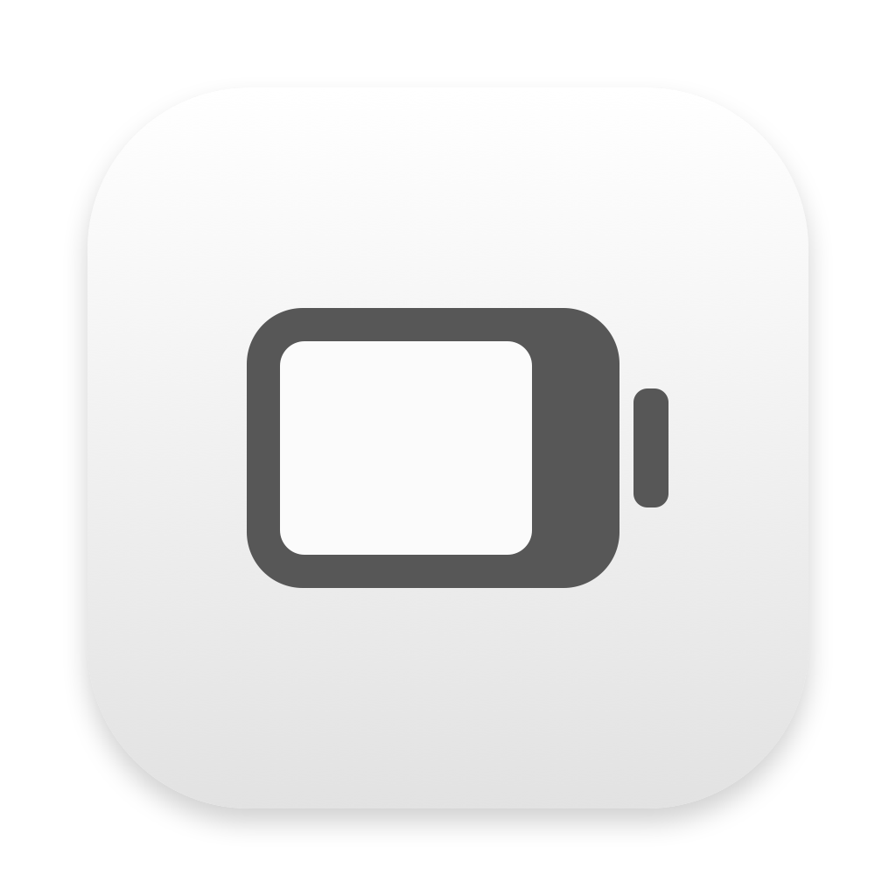
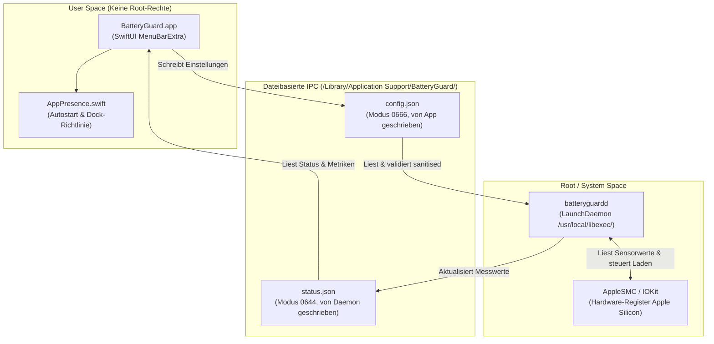

# BatteryGuard 🛡️🔋

<p align="center">
  
</p>

[](https://www.apple.com/macos/)
[](https://support.apple.com/apple-silicon)
[](https://swift.org)
[](LICENSE)

**BatteryGuard** ist ein leichtgewichtiges, quelloffenes Werkzeug für macOS (Apple Silicon), das die Lebensdauer deines MacBook-Akkus schont. Es verhindert unnötigen Verschleiß durch permanentes Verweilen bei 100 % Ladezustand, indem es intelligente Ladelimits direkt über das System Management Controller (SMC) Interface steuert.

---

## Screenshot

```
+-----------------------------------------------------------+
|                                                   [ 78% ] |
+-----------------------------------------------------------+
|  BatteryGuard                                             |
|  Status: Am Netzteil (Laden pausiert)                     |
|  Gesundheit: 98 % | Zyklen: 142 | Temperatur: 31.4 °C     |
|  -------------------------------------------------------  |
|  [x] Ladeschutz aktiv                                     |
|      Untere Grenze:  [ 20 % ]                             |
|      Obere Grenze:   [ 80 % ]                             |
|  [ ] Am Kabel aktiv entladen (> 80 %)                     |
|  [ ] Hitzeschutz (> 40 °C pausieren)                      |
|  [ ] Einmalig auf 100 % voll laden (z. B. vor Reisen)     |
|  -------------------------------------------------------  |
|  [x] Beim Anmelden starten (Autostart)                    |
|  [ ] Im Dock anzeigen (Menüleiste + Dock)                 |
|  -------------------------------------------------------  |
|  Dienst installieren... / Dienst neu starten              |
|  Beenden                                                  |
+-----------------------------------------------------------+
```
*(Screenshot-Platzhalter: Lege deinen Screenshot unter `Resources/screenshot.png` ab)*

---

## Kernfunktionen

- **Konfigurierbarer Ladebereich (z. B. 20–80 %):**
  Laden stoppt zuverlässig bei Erreichen des oberen Grenzwerts (`upperLimit`) und startet erst wieder, wenn der Akku unter das untere Limit (`lowerLimit`) fällt.
- **Aktives Entladen am Netzteil (`activeDischargeAboveUpper`):**
  Trennt den Ladeadapter softwareseitig, sodass der Akku auch bei eingestecktem Kabel aktiv auf den gewünschten Schwellenwert entladen werden kann.
- **Intelligenter Hitzeschutz (`heatProtectionCelsius`):**
  Pausiert das Laden automatisch, wenn die Akkutemperatur einen definierten Grenzwert (z. B. 40 °C) überschreitet, um hitzebedingte Zellalterung zu verhindern.
- **Einmalig voll laden (`chargeToFullOnce`):**
  Lädt das MacBook vor Reisen oder mobilen Einsätzen einmalig auf 100 %. Sobald der Akku vollständig geladen ist, wird das Flag vom Hintergrunddienst automatisch zurückgesetzt.
- **Vollständige System- und Desktop-Präsenz (`AppPresence`):**
  - **Launchpad & Programme:** Liegt standardmäßig in `/Applications` und erscheint durch macOS-LaunchServices-Registrierung automatisch im Launchpad.
  - **Schreibtisch-Alias:** Schneller Zugriff per Finder-Alias auf dem Desktop.
  - **Autostart (Launch at Login):** Automatisches Starten beim Login via modernem `SMAppService` (beim ersten Start standardmäßig aktiv).
  - **Menüleiste vs. Dock:** Standardmäßig schlank als Menüleisten-App (`LSUIElement = true`); optional kann per Klick ein reguläres Dock-Symbol zugeschaltet werden.
- **Hochwertiges Liquid-Glass Icon:**
  Abgerundetes Squircle-Design im tiefen Blau-Türkis-Look mit mattem Glasakku, leuchtendem 20–80 % Schutzbalken und Schutzkern (`Resources/AppIcon.icns`).

---

## Architektur

BatteryGuard setzt auf eine klare Trennung zwischen Benutzeroberfläche und Hardwarezugriff:



### IPC-Vertrag (`BatteryGuardShared`)
- **Pfad:** `/Library/Application Support/BatteryGuard`
- **`config.json`:** Wird von der App ohne Root-Rechte geschrieben (`0666`). Der Daemon liest die Datei periodisch ein und führt vor jeder Verarbeitung eine strikte Validierung (`BGConfig.sanitized()`) durch.
- **`status.json`:** Wird ausschließlich vom Root-Daemon geschrieben (`0644`) und stellt der UI alle Live-Daten (Ladezustand, Akkugesundheit, Ladezyklen, Temperatur, Wattzahl) bereit.

---

## Installation & Erste Schritte

### 1. App kompilieren & paketieren

Das Build-Skript erzeugt sowohl die Menüleisten-App als auch den Daemon im Release-Modus, packt das Bundle `dist/BatteryGuard.app`, integriert das `AppIcon.icns` und signiert die App ad-hoc:

```bash
./scripts/build-app.sh
```

Das Ergebnis liegt unter `dist/BatteryGuard.app` und als Archiv `dist/BatteryGuard.zip` bereit.

### 2. App auf dem Mac installieren (Benutzer-Installation)

Das Installationsskript installiert die App nach `/Applications`, bindet sie in das Launchpad ein und erstellt einen Finder-Alias auf dem Schreibtisch:

```bash
./scripts/install-app.sh
```

Was dieses Skript tut:
- Beendet eventuell laufende Instanzen von BatteryGuard.
- Kopiert die App nach `/Applications/BatteryGuard.app`.
- Entfernt das macOS-Quarantäne-Attribut (`com.apple.quarantine`).
- Registriert die App bei LaunchServices (`lsregister`), sodass sie **sofort im Launchpad und Spotlight** sichtbar ist.
- Legt einen Finder-Alias auf dem Desktop an (`~/Desktop/BatteryGuard`).
- Startet die App automatisch.

### 3. Hintergrunddienst (LaunchDaemon) installieren

Der Daemon `batteryguardd` benötigt Root-Rechte, um über IOKit mit dem AppleSMC zu kommunizieren.

- **Option A (aus der App):** Klicke in der Menüleiste auf *BatteryGuard* -> *Dienst installieren…*. macOS fordert dich nach deinem Administrator-Passwort.
- **Option B (über das Terminal):**
  ```bash
  sudo ./scripts/install-daemon.sh
  ```

Das Daemon-Installationsskript:
- Kopiert die Binärdatei nach `/usr/local/libexec/batteryguardd` (0755, `root:wheel`).
- Erstellt `/Library/Application Support/BatteryGuard` (0755).
- Richtet den LaunchDaemon `/Library/LaunchDaemons/com.batteryguard.daemon.plist` ein.
- Registriert und startet den Dienst via `launchctl bootstrap` und `launchctl kickstart`.

---

## Hilfsskripte für Entwicklung & Tests

- **App im Debug-Modus direkt ausführen:**
  ```bash
  ./scripts/dev-run.sh
  ```
- **Daemon-Testlauf (Dry-Run, ohne permanente Änderungen):**
  ```bash
  ./scripts/daemon-dry-run.sh
  ```
- **App-Icon neu generieren:**
  ```bash
  ./scripts/make-icon.swift
  ```

---

## Deinstallation

### 1. App deinstallieren (Benutzer-Ebene)
Entfernt `BatteryGuard.app` aus `/Applications`, löscht den Desktop-Alias und bereinigt den Autostart-Eintrag:

```bash
./scripts/uninstall-app.sh
```

### 2. Hintergrunddienst deinstallieren (Root-Ebene)
Stellt den Standard-Ladezustand wieder her (`--restore`), stoppt und entlädt den LaunchDaemon und löscht die Systemdateien:

```bash
sudo ./scripts/uninstall-daemon.sh
```

Um zusätzlich auch gespeicherte Einstellungen und Logdateien zu bereinigen:

```bash
sudo ./scripts/uninstall-daemon.sh --purge
```

---

## Sicherheitsmodell

1. **Kein unsicherer XPC-Dienst:**
   Anstelle eines komplexen XPC-Mechanismus erfolgt der Austausch ausschließlich über zwei JSON-Dateien in einem definierten Systemordner.
2. **Strikte Eingabe-Bereinigung (`sanitization`):**
   Obwohl die `config.json` für den Benutzer schreibbar ist, validiert der Daemon alle Parameter rigide:
   - Unteres Limit: 5 % bis 95 %
   - Oberes Limit: 20 % bis 100 % (stets größer als das untere Limit)
   - Hitzeschutz: 30 °C bis 50 °C (oder 0 für deaktiviert)
   - Es werden **keinerlei** Befehle, Pfade oder Shell-Skripte verarbeitet – Code Injection ist somit ausgeschlossen.
3. **Failsafe bei Programmende:**
   Wird der Daemon gestoppt (`SIGTERM`, Neustart oder via `uninstall-daemon.sh --restore`), werden alle SMC-Register wieder in ihren Standardzustand zurückversetzt. Das System lädt wieder wie gewohnt normal über das Netzteil.

---

## Haftungsausschluss & Wichtige Hinweise

> [!IMPORTANT]
> **Optimiertes Laden der Batterie deaktivieren:**
> Bitte deaktiviere in den macOS-Systemeinstellungen unter **Systemeinstellungen > Batterie > Batteriezustand (i) > „Optimiertes Laden der Batterie“**, damit macOS nicht gegen die Ladekontrolle von BatteryGuard arbeitet.

> [!WARNING]
> **Undokumentierte SMC-Schnittstellen & Eigene Verantwortung:**
> Die Ansteuerung des AppleSMC erfolgt über undokumentierte Register, die von Apple jederzeit mit neuen macOS- oder Firmware-Updates angepasst werden können. Die Nutzung der Software erfolgt vollständig auf **eigene Gefahr und eigenes Risiko**. Die Entwickler übernehmen keinerlei Haftung für eventuelle Schäden an Akku, Hardware oder Datenverlust.

---

## Hinweis zu macOS 26.4 / 27 (Pendel-Modus)

Auf neueren macOS-Versionen hat Apple die klassischen Lade-Sperr-Keys (`CHTE`, `CH0B`/`CH0C`) aus dem SMC entfernt.
BatteryGuard erkennt das beim Start (`batteryguardd --dump-keys CH` listet die vorhandenen Keys, nur lesend) und schaltet dann
automatisch in den **Pendel-Modus**: Das Limit wird ausschließlich über den Netzteil-Schalter (`CHIE`/`CH0J`/`CH0I`) erzwungen.
Ab dem Maximum (z. B. 80 %) läuft der Mac vom Akku, bei Maximum − 5 % wird das Netzteil wieder zugeschaltet.
Zusätzlich bietet macOS selbst unter *Systemeinstellungen → Batterie → Laden* ein natives Ladelimit (80–100 %).

---

## Danksagung & Inspiration (Credits)

BatteryGuard baut auf den Erkenntnissen und Pionierarbeiten der Open-Source-Community im Bereich macOS-Batteriesteuerung auf:

- [actuallymentor/battery](https://github.com/actuallymentor/battery) (MIT License) – CLI & Tooling für Apple Silicon Ladelimits.
- [charlie0129/batt](https://github.com/charlie0129/batt) (GPL-2.0 License) – Hintergrunddienst und SMC-Forschung.
- [mhaeuser/Battery-Toolkit](https://github.com/mhaeuser/Battery-Toolkit) (BSD-3-Clause License, archiviert) – Referenzarchitektur für macOS-Akkuschnittstellen.

*Hinweis: Der Quellcode von BatteryGuard wurde unabhängig und von Grund auf neu in modernem Swift 6 geschrieben.*

---

## English Summary

**BatteryGuard** is a lightweight open-source macOS menu bar utility (macOS 14+, Apple Silicon) designed to protect battery health and prolong battery lifespan by controlling charging limits directly via AppleSMC.

### Features
- Configurable charging threshold (e.g., 20–80%).
- Active discharge on AC adapter (`activeDischargeAboveUpper`).
- Battery heat protection (`heatProtectionCelsius`).
- One-time 100% full charge mode (`chargeToFullOnce`).
- Full system presence: Launchpad support, Desktop alias, Launch at Login (`SMAppService`), and optional Dock visibility.
- Liquid-glass app icon (`Resources/AppIcon.icns`).

### Quick Start
```bash
# 1. Build release app & daemon
./scripts/build-app.sh

# 2. Install to /Applications and launch
./scripts/install-app.sh

# 3. Install the root daemon
sudo ./scripts/install-daemon.sh
```

### Uninstallation
```bash
# Uninstall app and desktop alias
./scripts/uninstall-app.sh

# Uninstall root daemon
sudo ./scripts/uninstall-daemon.sh [--purge]
```

### Disclaimer
SMC keys on Apple Silicon are undocumented and may change across macOS updates. Please turn off "Optimized Battery Charging" in macOS Battery settings. Use at your own risk.

---

## Lizenz

Dieses Projekt ist unter der [MIT-Lizenz](LICENSE) lizenziert – Copyright © 2026 BatteryGuard contributors.
